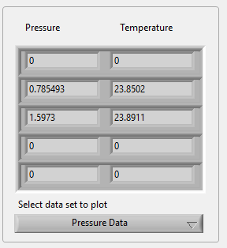

| ESEK-5C-SPI Evaluation Software Manual |                                        |
|----------------------------------------|----------------------------------------|
| Title                                  | ESEK-5C-SPI Evaluation Software Manual |
| Doc Ref                                | ESS-324/220822/EXC-REV.03              |

**  
**

**DOCUMENT TRACKING TABLE**

|             |           |                                                    |                  |
|-------------|-----------|----------------------------------------------------|------------------|
| **Version** | **Date**  | **Reason for change**                              | **Author**       |
| 1           | 5/8/2022  | Initial version                                    | C. Papazachariou |
| 2           | 20/9/2022 | Installer instructions                             | C. Papazachariou |
| 3           | 17/3/2023 | Timestamp on measurements (new) feature documented | C. Papazachariou |

**  
**

# **Table of Contents**

[1. Prerequisites and Installation.
[4](#prerequisites-and-installation.)](#prerequisites-and-installation.)

[2. Application Description and operation
[4](#application-description-and-operation)](#application-description-and-operation)

**Table of Figures**

[Figure 1: Software GUI [4](#_Toc110611786)](#_Toc110611786)

[Figure 2: Connect - Disconnect button
[5](#_Toc110611787)](#_Toc110611787)

[Figure 3: Scan Devices [5](#_Toc110611788)](#_Toc110611788)

[Figure 4: Sample rate and switch [5](#_Toc110611789)](#_Toc110611789)

[Figure 5: Sampled data values [6](#_Toc110611790)](#_Toc110611790)

[Figure 6: Plot quantity selection [6](#_Toc110611791)](#_Toc110611791)

[Figure 7: Plots and plot options. [7](#_Toc110611792)](#_Toc110611792)

[Figure 8: Log button and log file path
[7](#_Toc110611793)](#_Toc110611793)

[Figure 9: Logged Data example [9](#_Toc110611794)](#_Toc110611794)

**  
**

## Prerequisites and Installation.

To install the Pressure Sensor Evaluation Software:

• Run ESCP-MIS1_Evaluation_Software_Setup.exe (as administrator if
possible) and follow the installation wizard.

• Once the installation is complete run
ESCP-MIS1_Evaluation_Software.exe

## Application Description and operation

A general overview of the application graphical interface can be seen in
the following picture.

Figure 1: Software GUI

To start using the software, first select the appropriate COM port, then
click the “Connect” button which will change to “Disconnect” once the
connection is established. Clicking it again will disconnect the device.

Figure 2: Connect -
Disconnect button

Below the connection port and button, there is a list of connected
sensors and an indicator that the Devkit is connected. To populate this
list, press the “Scan Devices” button and all appropriately connected
sensors will be displayed in the list. The list describes the port of
the Evaluation Kit where each sensor is connected, a status indicator
led, the sensor Serial Number, and the current firmware version.

Figure 3: Scan Devices

To begin sampling the sensors, first setup the appropriate sample rate
which is 500 ms by default, then click on the “Sampling” toggle switch.

Figure 4: Sample rate and
switch

The sampled pressure and temperature data per sensor, are displayed in
an array format and the user can select one of the two quantities to
plot as a graph

Figure 5: Sampled data
values

The quantity selected will be displayed as a plot in the big plot area
next to the controls. The plot Legend sub-menu allows for sensor display
enabling selection, color selection for each plot line displayed, as
well as a Graph depth control for selecting how much time should be
displayed in the graph window.

Figure 6: Plot quantity
selection

Figure 7: Plots and plot
options.

Optionally the user can log the received data to a file. Use the
*Browse* button (folder icon) to select a directory for the log files
and press the button to start logging. The timestamp checkbox can be
selected to optionally append the date-time to the end of the line for
each measurement in the file in the following format:

*Year-month-date_hour-minute-second.millisecond*

Figure 8: Log button and
log file path

A log file for each sampling session is created with an auto-numbered
file name. Pressing the button again will stop logging. By default,
existing files are overwritten unless the *Append* option is checked.
Data is logged to the file at the rate specified in the Sample Rate
textbox as tab delimited values. The file has 10 columns which represent
sequentially the pressure and temperature readings of each sensor in the
order they have been connected, as shown in the following example.

| Pressure \#1 | Temperature \#1 | Pressure \#2 | Temperature \#2 | Pressure \#3 | Temperature \#3 | Pressure \#4 | Temperature \#4 | Pressure \#5 | Temperature \#5 |
|--------------|-----------------|--------------|-----------------|--------------|-----------------|--------------|-----------------|--------------|-----------------|
| 0            | 0               | 1.02863      | 23.883484       | 1.486506     | 23.935537       | 0            | 0               | 0            | 0               |
| 0            | 0               | 1.02863      | 23.881256       | 1.521374     | 23.931942       | 0            | 0               | 0            | 0               |
| 0            | 0               | 1.159739     | 23.883709       | 1.504195     | 23.934933       | 0            | 0               | 0            | 0               |
| 0            | 0               | 1.159739     | 23.883709       | 1.460245     | 23.936039       | 0            | 0               | 0            | 0               |
| 0            | 0               | 1.117866     | 23.876823       | 1.479252     | 23.935238       | 0            | 0               | 0            | 0               |
| 0            | 0               | 1.11659      | 23.883709       | 1.491029     | 23.945698       | 0            | 0               | 0            | 0               |
| 0            | 0               | 1.136992     | 23.884588       | 1.507447     | 23.939112       | 0            | 0               | 0            | 0               |
| 0            | 0               | 1.136992     | 23.884588       | 1.525152     | 23.938387       | 0            | 0               | 0            | 0               |
| 0            | 0               | 1.158864     | 23.888432       | 1.524794     | 23.940836       | 0            | 0               | 0            | 0               |
| 0            | 0               | 1.17171      | 23.884588       | 1.527845     | 23.943447       | 0            | 0               | 0            | 0               |
| 0            | 0               | 1.163408     | 23.874819       | 1.524309     | 23.944149       | 0            | 0               | 0            | 0               |

Figure 9: Logged Data
example
